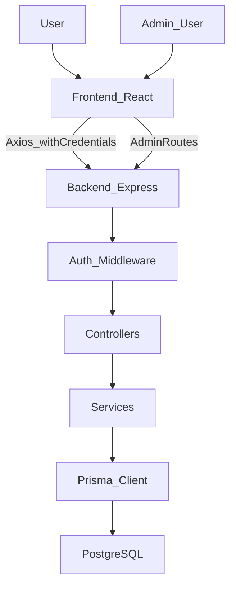

# خطة تنفيذ مشروع E‑Commerce (خطوة بخطوة)

هذه الخطة مبنية على ملفات التوثيق داخل مجلد `docs`:
- [docs/01-project-description.md](docs/01-project-description.md)
- [docs/02-technologies.md](docs/02-technologies.md)
- [docs/03-database-schema.md](docs/03-database-schema.md)
- [docs/04-architecture-endpoints.md](docs/04-architecture-endpoints.md)
- [docs/05-design-system.md](docs/05-design-system.md)

## أهداف الخطة
- تنفيذ تطبيق تجارة إلكترونية Full‑Stack بواجهات: عميل (Customer) + لوحة تحكم (Admin).
- Backend بـ Node.js/Express + TypeScript وفق نمط MVCS (Model/Controller/Service/Routes).
- قاعدة بيانات PostgreSQL عبر Prisma.
- Frontend بـ React + TypeScript (Vite) مع Tailwind فقط، React Router v6، React Query، Redux Toolkit.
- توثيق مسارات REST المذكورة، وتخزين JWT داخل Cookie (وليس LocalStorage).

## افتراضات تشغيلية (Defaults) سنعتمدها
- قاعدة البيانات: `ecommerce_db` وكلمة المرور `0000` كما في التوثيق (لاحقًا تُستبدل بمتغيرات سرية حقيقية في الإنتاج).
- الحماية: JWT داخل Cookie مع خصائص `httpOnly`, `secure` (في الإنتاج), `sameSite` حسب بيئة النشر.
- الصلاحيات: Role‑Based Access Control (ADMIN / CUSTOMER).
- حذف منطقي (Soft delete) للكيانات التي تتطلب أرشفة (Users/Products) كما ألمح التوثيق.

## تسلسل التنفيذ (Roadmap)

### المرحلة 0: تهيئة المشروع (Skeleton) والاتفاق على المعايير
- **Backend**
  - إنشاء هيكل مجلدات MVCS:
    - `src/models`, `src/controllers`, `src/services`, `src/routes`, `src/middlewares`, `src/utils`, `src/config`
  - إعداد:
    - TypeScript + ESLint/Prettier
    - إعدادات البيئة `.env` (DB_URL, JWT_SECRET, COOKIE_* …)
    - معالجة الأخطاء Logging + Error handler موحد
- **Frontend**
  - تهيئة Vite + React + TS.
  - Tailwind CSS فقط + ضبط خطوط Inter (أو بديل).
  - إعداد React Router v6 + Providers في `src/app`:
    - React Query Provider
    - Redux Provider
  - إعداد Axios instance في `src/config` مع interceptors للتعامل مع الأخطاء وتهيئة إرسال الكوكيز (`withCredentials`).

**مخرجات المرحلة 0**
- مشروع يقلع محليًا (backend + frontend) بدون ميزات، لكن جاهز للبناء فوقه.

---

### المرحلة 1: تصميم قاعدة البيانات عبر Prisma (حسب schema الموثق)
- بناء Prisma schema بحيث يغطي الجداول والعلاقات التالية (كما في [docs/03-database-schema.md](docs/03-database-schema.md)):
  - Users (مع role)
  - Categories
  - Products
  - Cart + CartItems (Cart واحد لكل User)
  - Wishlists (Unique compound index: userId + productId)
  - Orders + OrderItems (price snapshot وقت الشراء)
- إضافة Enums:
  - `Role = ADMIN | CUSTOMER`
  - `OrderStatus = PENDING | PROCESSING | SHIPPED | DELIVERED | CANCELLED`
- تطبيق migrations وتشغيل Prisma Client.

**مخرجات المرحلة 1**
- Prisma schema مكتمل + migrations ناجحة.
- Seeds (اختياري) لبيانات تجريبية: Admin، Categories، Products.

---

### المرحلة 2: بناء طبقة Auth (Cookies + JWT) + RBAC
المسارات المستهدفة (كما في [docs/04-architecture-endpoints.md](docs/04-architecture-endpoints.md)):
- `POST /api/auth/register`
- `POST /api/auth/login`
- `GET /api/auth/me`

**مهام التنفيذ**
- **Services**
  - `AuthService`: تسجيل مستخدم، تحقق كلمة المرور بـ bcryptjs، إصدار JWT.
- **Controllers**
  - `AuthController`: request/response + status codes موحدة.
- **Middlewares**
  - `authRequired`: قراءة JWT من Cookie والتحقق.
  - `requireRole('ADMIN')`: منع الوصول للمسارات الإدارية.
- **Security**
  - Cookie flags:
    - `httpOnly: true`
    - `sameSite: 'lax'` (أو 'none' عند فصل الدومينات مع HTTPS)
    - `secure: true` في الإنتاج
  - عدم إرجاع hash كلمة المرور لأي API.

**مخرجات المرحلة 2**
- Authentication يعمل end‑to‑end من الواجهة (login/register) وحتى `/me`.

---

### المرحلة 3: Users (إدارة المستخدمين والملف الشخصي)
المسارات المستهدفة:
- `GET /api/users` (Admin فقط)
- `GET /api/users/:id` (Admin & Account Owner)
- `PUT /api/users/:id` (Account Owner)
- `POST /api/users` (Admin فقط) لإنشاء حسابات (admin/staff/customer) حسب التوثيق
- `PUT /api/users/:id/role-status` (Admin فقط) لتغيير role أو ban/suspend
- `DELETE /api/users/:id` (Admin فقط) Soft delete / archive

**مهام التنفيذ**
- توحيد قواعد الوصول (Owner vs Admin).
- منع تعديل حقول حساسة إلا للإدمن (role/status).

**مخرجات المرحلة 3**
- APIs كاملة للمستخدمين مع حماية وصلاحيات صحيحة.

---

### المرحلة 4: Catalog (Categories + Products) مع Pagination/Filtering
المسارات المستهدفة:
- Categories:
  - `GET /api/categories`
  - `POST /api/categories` (Admin)
- Products:
  - `GET /api/products` (pagination + filtering by category + search إن لزم)
  - `GET /api/products/:id`
  - `POST /api/products` (Admin)
  - `PUT /api/products/:id` (Admin)
  - `DELETE /api/products/:id` (Admin) أرشفة/تعطيل (`isActive=false`) بدل حذف فعلي

**Frontend**
- صفحات:
  - `Home` (قائمة منتجات + فلاتر)
  - `ProductDetails`
- مكونات UI:
  - ProductCard, CategoryFilter, Pagination
- إدارة بيانات السيرفر:
  - React Query queries + caching keys.

**مخرجات المرحلة 4**
- كتالوج منتجات جاهز للشراء مع لوحات إدارة للإدمن (CRUD).

---

### المرحلة 5: Cart (السلة) كاملة
المسارات المستهدفة:
- `GET /api/cart`
- `POST /api/cart/items`
- `PUT /api/cart/items/:itemId`
- `DELETE /api/cart/items/:itemId`
- `DELETE /api/cart` (clear)

**قواعد عمل مهمة**
- منع إضافة منتج غير نشط `isActive=false`.
- فحص المخزون (stock) عند الإضافة والتعديل.
- حساب totals:
  - في الـ Backend: مصدر حقيقة (server‑side total).
  - في الـ Frontend: عرض سريع (client calc) مع إعادة تأكيد عند checkout.

**Frontend**
- صفحة `Cart`:
  - تحديث الكميات + إزالة + إجمالي.

**مخرجات المرحلة 5**
- تجربة سلة مستقرة، تمنع التلاعب بالكميات/الأسعار.

---

### المرحلة 6: Wishlist
المسارات المستهدفة:
- `GET /api/wishlist`
- `POST /api/wishlist/:productId`
- `DELETE /api/wishlist/:productId`

**Frontend**
- Heart toggle على ProductCard (Lucide icon) + animated states حسب [docs/05-design-system.md](docs/05-design-system.md).
- صفحة Wishlist (اختياري) مع زر “Move to cart”.

**مخرجات المرحلة 6**
- Wishlist تعمل مع منع التكرار عبر unique compound index.

---

### المرحلة 7: Orders + Checkout
المسارات المستهدفة:
- `POST /api/orders` (Checkout من cart)
- `GET /api/orders/my-orders`
- `GET /api/orders` (Admin)
- `PUT /api/orders/:id/status` (Admin)

**قواعد عمل مهمة**
- عند `POST /orders`:
  - قراءة cart items
  - إعادة التحقق من stock والأسعار الحالية
  - إنشاء Order + OrderItems مع `price` snapshot
  - خصم المخزون
  - تفريغ cart
- Status transitions منطقية (مثال: PENDING -> PROCESSING -> SHIPPED -> DELIVERED) مع السماح بـ CANCELLED وفق سياسة واضحة.

**Frontend**
- صفحة `Orders` للمستخدم (history + status).
- جزء checkout في `Cart` (عنوان الشحن + paymentMethod).

**مخرجات المرحلة 7**
- دورة شراء كاملة End‑to‑End.

---

### المرحلة 8: Admin Dashboard + Analytics
المسارات المستهدفة:
- `GET /api/admin/dashboard/stats`
- `GET /api/admin/dashboard/recent-orders`

**Frontend**
- Admin Layout:
  - Sidebar ثابتة + صفحات: Dashboard, Users, Products, Orders, Categories
- Data tables:
  - pagination + sorting + actions (edit/delete) كما في [docs/05-design-system.md](docs/05-design-system.md).
- Charts:
  - اختيار مكتبة (Recharts أو Chart.js) وعرض:
    - total revenue
    - total orders
    - users count
    - low stock products

**مخرجات المرحلة 8**
- لوحة تحكم إدارية متقدمة مع إحصائيات وطلبات حديثة.

---

### المرحلة 9: Design System وتوحيد تجربة المستخدم (UX)
حسب [docs/05-design-system.md](docs/05-design-system.md):
- تطبيق typographic scale (Headings/Body) + ألوان Tailwind (Primary/Secondary/Success/Danger/Warning).
- توحيد:
  - Buttons (solid/outline)
  - Inputs + validation states
  - Cards (hover effect)
  - Navbar sticky + search + profile + cart badge
- توحيد تعامل الأخطاء/الـ empty states/loading skeletons.

**مخرجات المرحلة 9**
- واجهة متناسقة، قابلة للتوسع، وتجربة استخدام ممتازة.

---

### المرحلة 10: الجودة، الأمان، والجاهزية للإنتاج
- **Code quality**
  - تطبيق SOLID و DRY كما في التحذيرات.
  - فصل الـ concerns (Controllers لا تحتوي business logic).
- **Validation**
  - Backend: validation middleware للـ payloads.
  - Frontend: React Hook Form + Yup لكل الفورمات (login/register/checkout/admin forms).
- **Security**
  - Rate limiting على auth endpoints.
  - CORS مضبوط مع `credentials: true`.
  - Sanitization/escaping إن لزم.
- **Testing (اختياري لكن موصى به)**
  - Backend: tests لخدمات حرجة (checkout, auth).
  - Frontend: smoke tests للصفحات الأساسية.
- **Assets**
  - صور المنتجات placeholder في dev، وتجهيز خطوة ترحيل Cloudinary لاحقًا.
- **Deployment**
  - إعداد بيئات: dev/staging/prod.
  - ضبط `secure cookies` وHTTPS.

**مخرجات المرحلة 10**
- تطبيق جاهز للنشر مع أساسيات الأمان والجودة.

---

## خريطة تدفق عالية المستوى (Mermaid)

## قائمة تنفيذ مختصرة (Checklist)
- [ ] تهيئة Backend + Frontend + Providers + Axios
- [ ] Prisma schema + migrations
- [ ] Auth (JWT in Cookie) + RBAC
- [ ] Users APIs + Admin management
- [ ] Categories + Products CRUD + listing/filtering
- [ ] Cart APIs + UI
- [ ] Wishlist APIs + UI
- [ ] Orders/Checkout + UI
- [ ] Admin dashboard + analytics + charts
- [ ] توحيد design system + polish UX
- [ ] hardening + validation + deployment readiness

